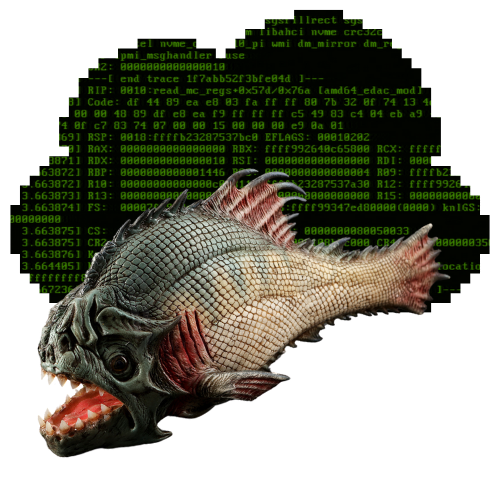

> Protect against phishing attacks

# Functionality

This rule is built using malicious URLs and domains involved in phishing attacks. We utilize some community APIs to construct these rules, and with them, we create TLS, DNS, and HTTP rules.

Our sources:
1. [Phishstats](https://phishstats.info)
2. [Openphish](https://openphish.com/)

# Use
After download `antiphishing.rules` and `phishing.lst` move for `/etc/suricata` or you directory rulesets.
Now restart suricata daemon.

# Updates
Our rule updates hourly and includes SIDs that take other rulesets into consideration. Range: 6000000 - 6100000
