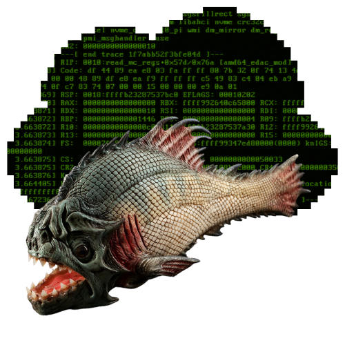

[ 
[DONATE](./FUNDING.md) - [DASHBOARD VECTORS](https://julioliraup.github.io/AT) - [CONTRIBUTING](./CONTRIBUTING.md) - [WIKI](/julioliraup/Antiphishing/wiki)
]
> Protect against phishing attacks

# Functionality

This rule is built using malicious URLs and domains involved in phishing attacks. We utilize some community APIs to construct these rules, and with them, we create TLS, DNS, and HTTP rules.

Our sources:
1. [Phishstats](https://phishstats.info)
2. [Openphish](https://openphish.com/)

Contribution: [CONTRIBUTING.md](https://github.com/julioliraup/Antiphishing/blob/main/CONTRIBUTION.md)

# Installation guide

## Upcoming Guides

# Updates & Automation
Our ruleset is updated dynamically every ~6 hours to track emerging phishing vectors. 
- **SID Range:** `6000000` - `6100000` (Carefully assigned to prevent conflicts with other [rulesets](https://sidallocation.org/))  .
- **Format:** Fully compatible with `suricata-update`.

---

## 🛡️ Enterprise Support & Funding

This project is open-source and free for both personal and commercial use. To maintain high-availability infrastructure, automated collection pipelines, and our Threat Intelligence Lookup Portal ([/AT](https://julioliraup.github.io/AT)), we rely on community and corporate funding.

### Why Sponsor?
* **Infrastructure Sustainability:** Funds go directly toward dedicated servers for rule generation and processing licenses.
* **Corporate Visibility:** Companies contributing above a certain threshold can feature their logo in this README.

#### 🇧🇷 Donation via PIX (Brazil)
You can support the project instantly via PIX:
* **PIX Key:** `08650081401`
* **Beneficiary:** Júlio Lira

#### 🌐 International Backers
For recurring sponsorship, priority support, or international donations, please check our [FUNDING.md](./FUNDING.md) or use the **Sponsor** button at the top of this repository.

---

## Contact & False Positives

If you encounter any false positives, have suggestions, or want to discuss corporate partnerships:
- **Email:** [jul10l1r4@disroot.org](mailto:jul10l1r4@disroot.org)
- **Issues:** Please open a GitHub Issue for rule adjustments.

