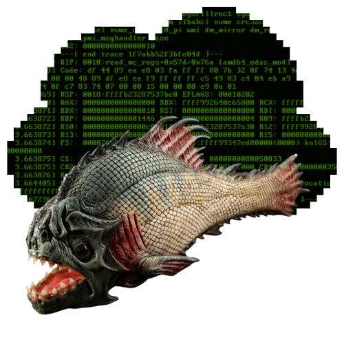

 

[
[DONATE](https://github.com/sponsors/julioliraup) - [DASHBOARD VECTORS](https://julioliraup.github.io/AT) - [CONTRIBUTING](./CONTRIBUTING.md) - [SUBMIT A VECTOR](/julioliraup/Antiphishing/issues/new?q=state%3Aopen+label%3A%22Phishing+Vector%22) - [REST API CTI](https://github.com/julioliraup/AT/wiki/REST-API-USE) - [WIKI](/julioliraup/Antiphishing/wiki)
]

> **Predictive Phishing Intelligence for Suricata: Block the Adversary at Day Zero**

**Antiphishing** is an open-source (GPLv3) Cyber Threat Intelligence (CTI) infrastructure and Suricata ruleset designed to proactively neutralize phishing infrastructure at the network layer. 

By combining curated threat indicators with aggressive Newly Registered Domain (NRD) heuristics, Antiphishing provides a deployment-ready Suricata ruleset that stops attacks before they mature.

---

## ⚡ Predictive Defense: Blocking the Enemy Before Detection

Modern threat actors operate in a volatile window. A domain is registered, weaponized, and discarded within hours. If you are waiting for a domain to appear on a traditional blocklist, the adversary has already breached the perimeter.

Antiphishing flips this paradigm. We take a **Predictive Defense** approach:
Our pipeline monitors Newly Registered Domains (NRDs) with observed DNS activity. We process **over 1.5 million domain combinations**, applying advanced heuristics (typosquatting, homoglyph detection, and brand impersonation patterns).

The result? We empower your Suricata engine to **block the enemy's infrastructure before any prior global detection exists.** We cut off the attack vector while the adversary is still setting up their servers.

---

## 🛡️ Radical Transparency: Suspicious vs. Malicious

To achieve true zero-day blocking, an intelligence engine must be aggressive. We believe in radical transparency with the security community regarding how this data should be applied:

Domains classified by our NRD analysis pipeline act as a **Candidate-Generation Mechanism**. They must be treated as **Highly Suspicious Infrastructure**, not manually validated malicious vectors (IOCs).

**⚠️ The False Positive Trade-off:**
Because our engine prioritizes preemptive blocking over retroactive certainty, there is a chance of false positives. This NRD dataset is designed for SOCs, MSSPs, and Admins who prefer to proactively block suspicious emerging infrastructure and whitelist the exceptions, rather than waiting for a breach to happen.

*If you demand absolute certainty, you will always be one step behind the attacker. Antiphishing gives you the advantage of anticipation.*

**Standing on the Shoulders of Giants (Open-Source Ecosystem):**
It is important to state that Antiphishing does not exist in a vacuum. We heavily utilize external free software, open-source libraries, and community APIs to process our NRDs and threat feeds. We build the intelligence pipeline and the Suricata correlation, but the project relies on the broader open-source community's tools to make this analysis possible.

---

## ⚙️ How It Works (Detection Layers)

The ruleset (`antiphishing.rules`) and its datasets seamlessly deploy on your Suricata instance to provide multi-layered inspection. *(Note: Action capabilities—alerting vs. blocking—depend on whether Suricata is deployed in IDS or IPS mode)*:

*   **DNS:** Interception during the resolution phase (`dns.query`). Identify or stop the connection before the handshake.
*   **TLS:** Domain-based detection via Server Name Indication (`tls.sni`), requiring no HTTPS payload decryption.
*   **HTTP:** Deep packet inspection for visible application-layer traffic.
*   **IPv4:** Direct correlation of network flows with known malicious infrastructure using Suricata's highly efficient `dataset` keyword (`type ipv4`).

### Direct Distribution Links
*   **Tarball Archive:** `https://github.com/julioliraup/Antiphishing/raw/refs/heads/main/antiphishing.tar.gz` (contains the rules and datasets below)
*   **OPNsense Tarball:** `https://github.com/julioliraup/Antiphishing/raw/refs/heads/main/antiphishing-opnsense.tar.gz` (special package where datasets use `.rules` extension)
*   **Rules File:** `https://github.com/julioliraup/Antiphishing/raw/refs/heads/main/antiphishing.rules`
*   **Phishing Domains Dataset:** `https://github.com/julioliraup/Antiphishing/raw/refs/heads/main/phishing.lst`
*   **Phishing IPs Dataset:** `https://github.com/julioliraup/Antiphishing/raw/refs/heads/main/phishing_ips.lst`

---

## 🚀 Installation guide

Our architecture is built for rapid deployment. 
*Note: After updating `phishing.lst`, the Suricata ruleset must be reloaded for the updated dataset to become active.*

)

### Upcoming Guides

---

## 🔄 Updates & Automation
Our intelligence engine updates dynamically every ~6 hours to track emerging phishing vectors. 
- **SID Range:** `6000000` - `6100000` (Carefully assigned to prevent conflicts).
- **Format:** Fully compatible with `suricata-update`.

---

## 🙏 Acknowledgments
A special and sincere thanks to [@antixmars](https://github.com/antixmars), [@sikysikov](https://github.com/sikysikov), [@satta](https://github.com/satta), and [@zoomequipd](https://github.com/zoomequipd) for their contributions, insights, and support. Antiphishing is a collaborative ecosystem, and good work deserves to be recognized. Thank you for helping build this project.

---

## 💛 Support This Project (Funding & Sustainability)

Antiphishing is maintained as an independent, public security infrastructure. We believe that predictive threat detection should not be locked behind corporate paywalls. 

However, **maintaining an aggressive zero-day intelligence pipeline has hard, unavoidable costs.** To process millions of signals and preemptively block adversaries, the project relies heavily on paid infrastructure. 

Your sponsorships are strictly used to fund the operation and evolution of this engine:
* **API Licenses:** Commercial access for historical WHOIS, reverse DNS, and deep domain analytics.
* **NRD Processing Power:** Substantial VPS CPU and RAM overhead to process over 1.5 million domain combinations daily.
* **Hosting & Distribution:** Keeping the REST API, Dashboards, and global ruleset distribution reliable and fast.

### 🏢 Corporate Reciprocity (For MSSPs, SOCs, and Enterprises)
If your organization uses Antiphishing to protect client networks, this project provides the capabilities of a commercial Threat Intelligence Platform (TIP) at zero cost. **We are performing the heavy computational lifting of a dedicated Threat Intel team.**

By sponsoring the project, you are **insuring your own defenses**. You guarantee that our servers stay online, our API limits expand, and our predictive detection capabilities continue to protect your clients without interruption. We do not restrict our intelligence behind premium data feeds or paywalls; your sponsorship is the sole mechanism that keeps this engine running.

#### 🇧🇷 Apoio via PIX (Brasil)
Se o projeto protegeu sua rede, ajudou nos seus estudos ou economizou horas do seu tempo de resposta a incidentes, considere apoiar a infraestrutura:
- **Chave PIX:** `08650081401`
- **Beneficiário:** Júlio Lira

#### 🌐 GitHub Sponsors (International)
For recurring support or one-time contributions from corporate entities or individuals: 
[github.com/sponsors/julioliraup](https://github.com/sponsors/julioliraup)

---

## Contact & False Positives
If you encounter any false positives, have suggestions, or want to discuss corporate partnerships:
- **Email:** [jul10l1r4@disroot.org](mailto:jul10l1r4@disroot.org)
- **Issues:** Please open a [GitHub Issue](https://github.com/julioliraup/Antiphishing/issues) for false positive tuning and rule adjustments.
